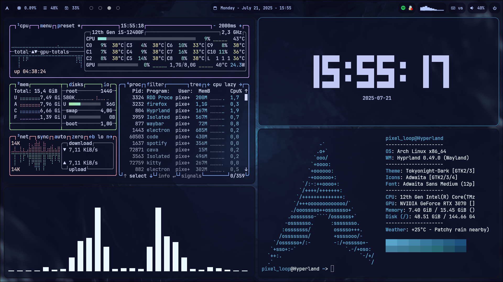
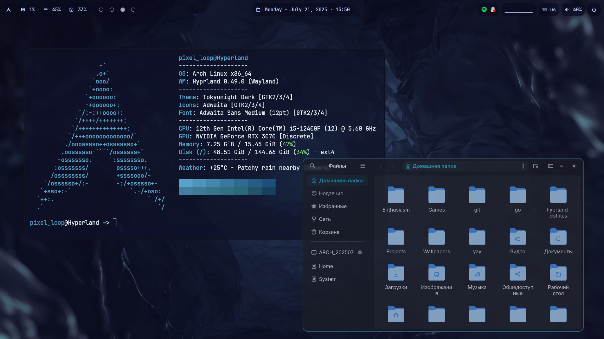
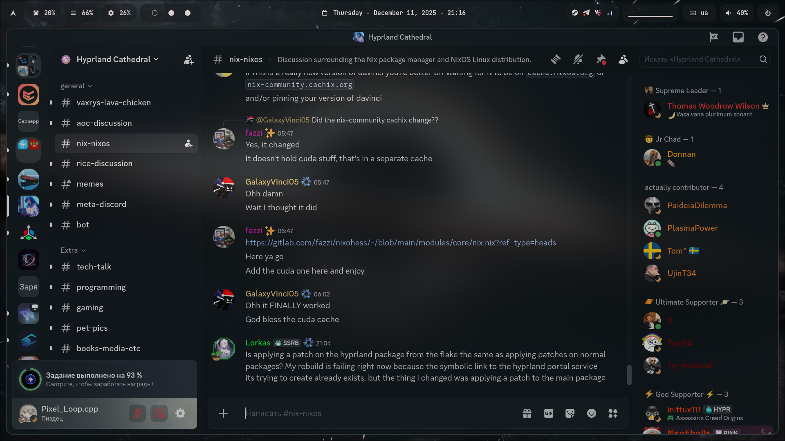
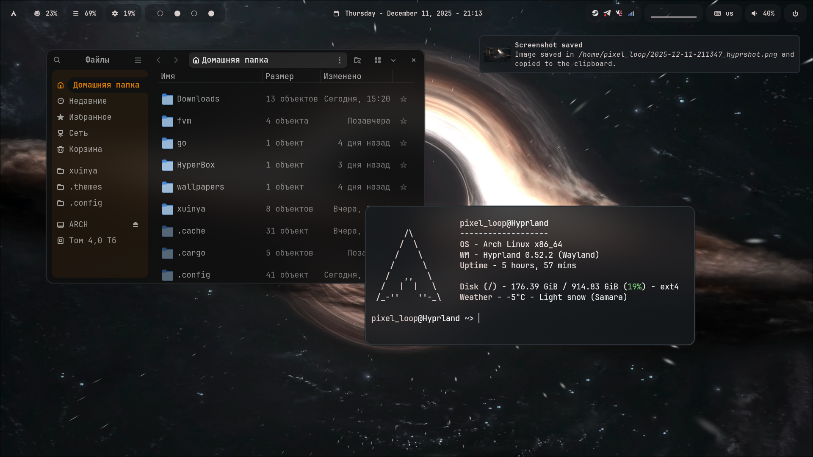

<h1 align="center">❄️ My Hyprland Rice ❄️</h1>

<h1 align="left"> ☁️ About</h1> 


</br>

 - Distro: [**`ArchLinux`**](https://archlinux.org/)
 - WM: [**`Hyprland`**](https://hypr.land/)
 - Bar: [**`Waybar-cava`**](https://github.com/ray-pH/waybar-cava)
 - Compositor: [**`Wayland`**](https://wayland.freedesktop.org/)
 - Terminal: [**`Kitty`**](https://github.com/kovidgoyal/kitty)
 - App Launcher: [**`Wofi`**](https://github.com/SimplyCEO/wofi)
 - Notify Daemon: [**`Swayns`**](https://github.com/ErikReider/SwayNotificationCenter)
 - Shell: [**`Fish`**](https://github.com/fish-shell/fish-shell)

</br>


## 🖼️ Gallery





## :moyai: Installation
Clone this repo
````bash
git clone 'https://github.com/PixelLoop-dev/hyprland-dotfiles.git'
````

Move to hyprland-dotfiles
````bash
cd hyprland-dotfiles
````

Run the installer
````bash
./install.sh
````

And reboot
````bash
reboot
````

## 💻 HotKeys
| Hotkey | Description    |
|--------|----------------|
| Super + Q| Open the terminal |
| Super + E| Open the application menu |
| Super + R| Open the files manager |
| Super + C| Kill active window |
| Super + F| Toggle fullscreen |
| Super + V| Toggle floating |
| Super + M| Exit |
| Alt + Q| Make a screenshot |
| Alt + E| Picking a color from screen |
